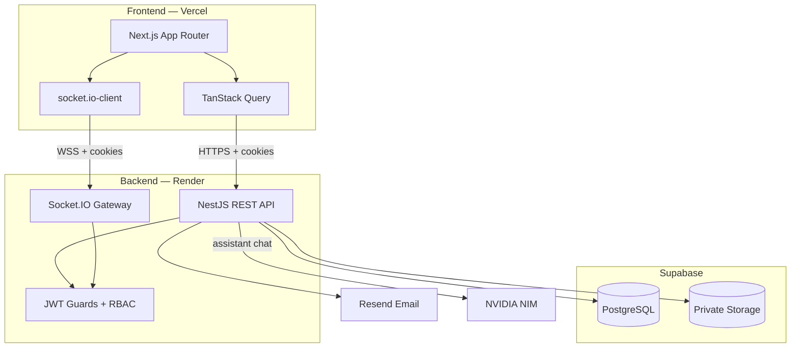
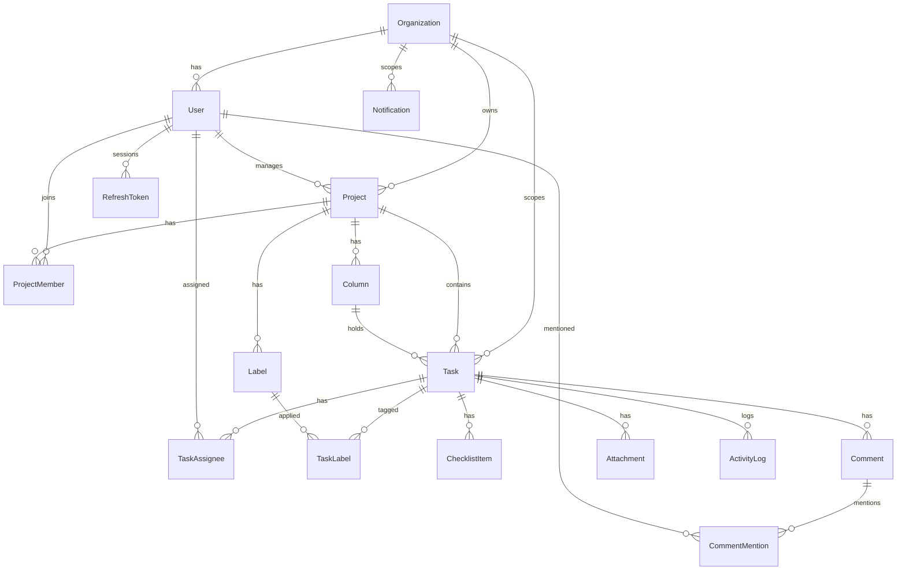
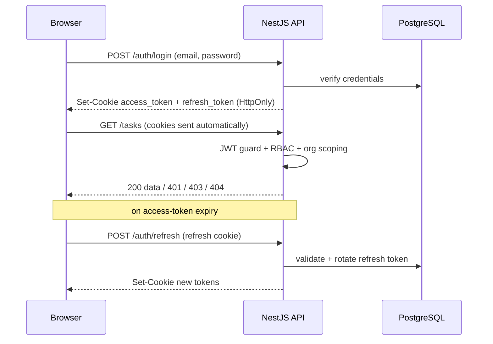
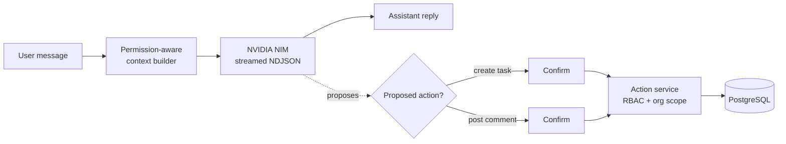
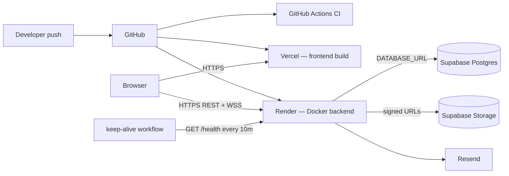

# Nuvela

A calm, multi-tenant, role-based Kanban task-management workspace built for INTE 21323.

**Live demo**

| App | URL |
|---|---|
| Frontend | https://nuvela.space |
| Backend API | https://nuvela.onrender.com |
| Swagger UI | https://nuvela.onrender.com/api |
| Health check | https://nuvela.onrender.com/health |

## Overview

Nuvela is a decoupled full-stack app: a Next.js client on Vercel talks to a NestJS REST + WebSocket API on Render. Data lives in Supabase (PostgreSQL + private Storage); transactional email uses Resend; an in-app AI assistant is backed by NVIDIA NIM. Auth is self-rolled JWT in **HTTP-only cookies** with org-scoped RBAC (Owner, Admin, Project Manager, Collaborator).

## Features

- **Multi-tenant orgs** — every record is scoped by `organizationId`; cross-tenant access returns `404` so existence is never leaked.
- **Four roles, one UI** — Owner, Admin, Project Manager, and Collaborator share the same screens but only see the actions they're allowed.
- **Kanban board** — drag tasks across **To Do → In Progress → Review → Completed**. The **Completed** column is **PM-gated**: only a Project Manager can move work into it.
- **Rich tasks** — assignees, labels, priority, due dates, checklists, comments with `@mentions`, file attachments, and a per-task activity log.
- **Real-time notifications** — persist-then-push over Socket.IO for assignments, status changes, mentions, deadlines, and project transfers.
- **Private file storage** — uploads live in private Supabase buckets and are served only through short-lived signed URLs (buckets are never public).
- **AI assistant** — a permission-aware chat drawer that answers questions about your work and can propose task creation / comments, executed only after you confirm.
- **Dashboard & search** — a per-role overview plus cross-project task search.

## Architecture



## Tech stack (locked TRD)

| Layer | Choice |
|---|---|
| Frontend | Next.js 16 (TypeScript, App Router), Tailwind v4, shadcn/ui (`@base-ui/react`), TanStack Query, React Hook Form + Zod, dnd-kit, socket.io-client, date-fns |
| Backend | NestJS 11, Prisma 6, Passport JWT, class-validator, Socket.IO, `@nestjs/swagger`, `@nestjs/throttler`, `@nestjs/schedule` |
| Database | PostgreSQL on Supabase |
| File storage | Supabase Storage (private buckets, signed URLs) |
| Email | Resend |
| AI assistant | NVIDIA NIM (OpenAI-compatible, streamed NDJSON) |
| Hosting | Vercel (frontend), Render (backend Docker) |
| CI | GitHub Actions (`ci.yml`) |

## Data model

Core entities (full Prisma schema in [`backend/prisma/schema.prisma`](backend/prisma/schema.prisma)):



## Auth & security

Login sets `access_token` + `refresh_token` as **HTTP-only cookies**; the browser sends them automatically with `credentials: 'include'`, and the access token is silently rotated via `/auth/refresh`.



Enforced cross-cutting invariants: multi-tenant `organizationId` scoping, `401/403/404` RBAC (404 hides cross-tenant existence), PM-gated Completed column, signed-URL-only file access, persist-then-push notifications, no hard deletes, and validation at both layers.

## AI assistant

The assistant streams responses as NDJSON and can **propose** mutations, but never performs them silently — the user confirms each proposed action, and the action runs through the same RBAC + org-scoping as any other write.



Endpoints: `POST /assistant/chat` (stream), `POST /assistant/actions/create-task`, `POST /assistant/actions/post-comment`. Requires `NVIDIA_API_KEY` in the backend runtime env.

## Repository layout

Two independent, decoupled deployables under one repo — no monorepo tooling; each app has its own `package.json`.

```
nuvela/
  frontend/     # Next.js client            → Vercel
  backend/      # NestJS API + WS gateway    → Render (Dockerfile)
  diagrams/     # Mermaid sources (ER, architecture, deployment)
  build.ps1     # lint → typecheck → test → build (both apps)
```

Planning docs live in `docs/` (local/gitignored in this clone).

## Local setup

### Prerequisites

- Node.js 20+
- npm
- Supabase project (Postgres + Storage) or local Postgres with `DATABASE_URL` / `DIRECT_URL`

### Environment

Copy `.env.example` values into:

- `backend/.env` — server secrets (`DATABASE_URL`, `DIRECT_URL`, JWT secrets, Supabase, Resend, `NVIDIA_API_KEY`, `FRONTEND_URL`, `BACKEND_URL`)
- `frontend/.env.local` — `NEXT_PUBLIC_BACKEND_URL=http://localhost:3001`

Never commit `.env` files.

### Backend

```powershell
cd backend
npm ci
npx prisma migrate dev
npx prisma db seed          # optional demo data
npm run start:dev           # http://localhost:3001
```

Swagger UI (local): http://localhost:3001/api

### Frontend

```powershell
cd frontend
npm ci
npm run dev                 # http://localhost:3000
```

### Full verify

```powershell
./build.ps1
cd backend; npm run test:e2e
```

## API usage

- **Base URL:** `BACKEND_URL` / `NEXT_PUBLIC_BACKEND_URL`
- **Auth:** `POST /auth/login` sets `access_token` and `refresh_token` HTTP-only cookies. Send cookies on subsequent requests (`credentials: 'include'` in the browser).
- **Refresh:** `POST /auth/refresh` rotates tokens.
- **Errors:** `{ statusCode, code, message }` JSON (see Swagger for per-endpoint codes).
- **Interactive docs:** [Swagger UI](https://nuvela.onrender.com/api) — use cookie auth after logging in via the app or `/auth/login` in another tab.

## Deployment



- **Render** builds `backend/Dockerfile`; binds `0.0.0.0:$PORT`. Set all TRD env vars; `FRONTEND_URL` must match the Vercel origin for CORS + cookies.
- **Vercel** builds `frontend/`; set `NEXT_PUBLIC_BACKEND_URL` to the Render URL.
- **Keep-alive:** `.github/workflows/keep-alive.yml` pings `/health` every 10 minutes to reduce Render free-tier cold starts before demos.

> The diagrams above render automatically on GitHub. Editable Mermaid sources also live in [`diagrams/`](diagrams/).

## Testing

```powershell
./build.ps1
cd backend; npm run test:e2e
```

Backend: **159** unit tests + **72** e2e tests across auth, the RBAC permission matrix, tasks/board, collaboration, notifications, dashboard/search, the AI assistant, and the Phase 10 regression suite. The RBAC tests assert that per role, forbidden actions return `401/403` and cross-tenant access returns `404`.

## Contributing

1. Branch from `development` using persistent themed branches (`feat/<area>`, `chore/<task>`).
2. One squash PR per small feature into `development`; phase milestones merge `development` → `main` with `--no-ff`.
3. Run `./build.ps1` before opening a PR.
4. Plain commit subjects only — no `Co-authored-by` trailers. Run `./setup-githooks.ps1` once per clone to enable the commit-msg hook.

## License

Academic project — see course submission requirements.
